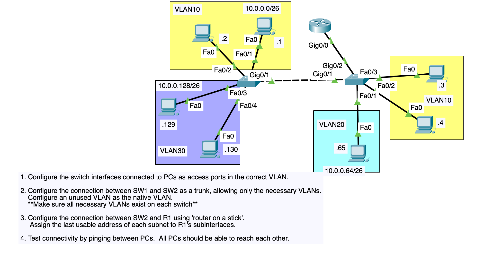

# VLAN Trunking + Router-on-a-Stick Lab (Packet Tracer)

Two switches (**SW1**, **SW2**) connected by a trunk, three VLANs (10, 20, 30) spanning
both switches, and a single router (**R1**) doing inter-VLAN routing over one physical
link to SW2 using **router-on-a-stick** (subinterfaces + 802.1Q).

## Topology



## Repo structure

```
vlan-trunking-lab/
├── README.md                     ← this file
├── docs/
│   └── ip-addressing-table.md    ← VLAN/subnet/gateway/PC IP plan
├── configs/
│   ├── R1-config.txt             ← router-on-a-stick subinterface config
│   ├── SW1-config.txt            ← access ports + trunk to SW2
│   └── SW2-config.txt            ← access ports + trunk to SW1 + trunk to R1
├── topology/
│   ├── topology-diagram.png      ← original topology screenshot
│   └── topology-notes.md         ← port-by-port connection map
└── verification/
    └── ping-tests.md             ← full-mesh connectivity test plan
```

## Design summary

- **VLAN 10** (10.0.0.0/26) spans both switches — PCs .1/.2 on SW1, PCs .3/.4 on SW2.
- **VLAN 20** (10.0.0.64/26) lives only on SW2 — PC .65.
- **VLAN 30** (10.0.0.128/26) lives only on SW1 — PCs .129/.130.
- **SW1 ↔ SW2** link is a trunk carrying only VLANs 10, 20, 30 (not "all" VLANs), with an
  **unused VLAN (999)** set as the native VLAN — a security best practice so untagged/DTP
  traffic doesn't accidentally land in a real data VLAN.
- VLANs 10, 20, and 30 are created in the VLAN database on **both** switches, even where a
  switch has no local access port in that VLAN — required so the trunk can carry it and so
  STP treats it consistently on both ends.
- **SW2 ↔ R1** link is also a trunk (router-on-a-stick requires this), carrying VLANs 10/20/30.
- **R1** has one physical interface (Gig0/0, no IP) and three subinterfaces
  (Gig0/0.10, .20, .30), each 802.1Q-tagged for its VLAN, each addressed with the
  **last usable IP** in its subnet (the gateway).

## Quick start
1. Check `docs/ip-addressing-table.md` for exact IPs/masks/gateways.
2. Paste `configs/SW1-config.txt` and `configs/SW2-config.txt` into the switches.
3. Paste `configs/R1-config.txt` into R1.
4. Set each PC's IP config per the addressing table.
5. Run through `verification/ping-tests.md` — every PC should reach every other PC.
